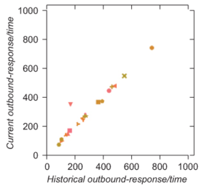

# Metrics Catalog or What should I monitor?

Tackling the sheer number of available metrics can be very hard. 
This page lists some recommended metrics you should always monitor.

## Business Layer

Metrics on the business layer usually focus on providing some information about 
the usage of business features, functions or processes.

| Metric | Description |
| --- | --- |
| feature-invocation-count | number of invocations by business feature |
| feature-invocation-pass | number of invocations processed successfully by business feature |
| feature-invocation-time | execution time of each invocation by business feature |

## Message Layer

Metrics of the message layer refer to the messages passed between services.

| Metric | Description | Aggregation |
| --- | --- | --- |
| outbound-send-count | number of outbound requests messages | count over a period of time |
| outbound-send-pass | number of outbound requests messages successfully sent | count over a period of time |
| outbound-response-count | number of outbound responses messages | count over a period of time |
| outbound-response-pass | number of send outbound response messages successfully sent | count over a period of time |
| outbound-response-time | response time of each outbound response message | mean or percentile over response times |
| inbound-receive-count | number of inbound request messages | count over a period of time |
| inbound-receive-valid | number of inbound request messages accepted as valid messages | count over a period of time |
| inbound-receive-pass | number of inbound request messages successfully processed | count over a period of time |
| inbound-response-count | number of inbound response messages | count over a period of time |
| inbound-response-pass | number of inbound response messages indicating successful outcome | count over a period of time |
| inbound-response-time | response time of each inbound response | mean or percentile over response times |

Recommended diagrams are:

| Diagram | Description |
| --- | --- |
| inbound-receive-count / inbound-receive-pass | ratio of number of inbound request vs number of successfully processed requests rendered as scatterplots indicate problems of a particular service |
| inbound-response-time (time current) / inbound-response-time (time past) | ratio of current inbound response times vs historical inbound response times rendered as scatterplots indicate problems of a downstream service from a upstream service perspective |
| outbound-response-time (time current) / outbound-response-time (time past) | ratio of current outbound response times vs historical outbound response times rendered as scatterplots indicate problems of a particular service |

!!! tip "The Power of Scatterplots"
    Choosing the right type of diagram with the right type of aggregation is essential to detect problems easily.
    
    
    [Scatterplots](https://en.wikipedia.org/wiki/Scatter_plot) which compare current telemetry data to historical telemetry data
    are the perfect choice to visualize anomalies. In this sample taken from Richard Rodgers
    excellent book "The Tao of Microservices" (see reference section for details) everything *normal* sticks more
    or less to the same diagonal line. The single symbol outside the line clearly indicates abnormal behaviour of 
    a particular service.  

## Application Layer

Metrics of the application layer provide telemetry data about what's happening within an application.

| Metric | Description |
| --- | --- |
| jvm-memory-used | number of bytes used JVM memory |
| jvm-memory-free | number of bytes of free JVM memory |
| http-listener-queue-depth | number of inbound request messages waiting in the http listener's input queue |
| http-listener-threads-used | number of used threads in the http listener's thread pool |
| http-listener-threads-free | number of free threads in the http listener's thread pool |
| jdbc-connection-pool-used | number of used JDBC connections |
| jdbc-connection-pool-free | number of free JDBC connections |
| jdbc-statement-count | number of processed JDBC statements |
| jdbc-statement-pass | number of successfully processed JDBC statements |
| jdbc-statement-time | execution time of each JDBC statement |
| transaction-count |  number of completed transactions |
| transaction-pass | number of successfully committed transaction |
| transaction-time | execution time of each transaction |

## Infrastructure Layer

Metrics of the infrastructure layer focus on what's going on on nodes, virtual machines, network, storage etc.

| Metric | Description |
| --- | --- |
| *-memory-used | current RAM utilization on a node, pod, container, namespace in bytes |
| *-memory-free | remaining RAM capacity on a node, pod, container, namespace in bytes |
| *-cpu-used | current CPU utilization of node, pod, container, namespace |
| *-cpu-free | remaining CPU capacity on a node, pod, container, namespace |
| *-storage-used | current storage utilization of node, pod, container, namespace in bytes |
| *-storage-free | remaining storage capacity on a node, pod, container, namespace in bytes |
| *-network-io-used | current network I/O utilization of node, pod, container, namespace in bytes per second |
| *-network-io-free | remaining network I/O capacity on a node, pod, container, namespace in bytes per second |
| *-disk-io-used | current disk I/O utilization of node, pod, container, namespace in bytes per second |
| *-disk-io-free | remaining disk I/O capacity on a node, pod, container, namespace in bytes per second |
| pod-restart-count | number of restarts per pod |
| pod-autoscaler-used | number of replicas per HPA currently used |
| pod-autoscaler-free | number of replicas per HPA still remaining |
| deployment-count | number of application deployments |
| deployment-pass | number of successful application deployments |

## References

* Richard Rodgers,
  [The Tao of Microservices](https://www.manning.com/books/the-tao-of-microservices), 
  Manning December 2017, 
  ISBN 9781617293146