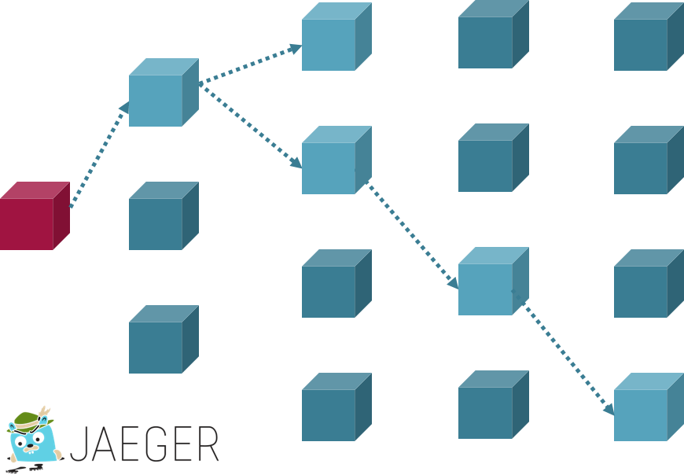
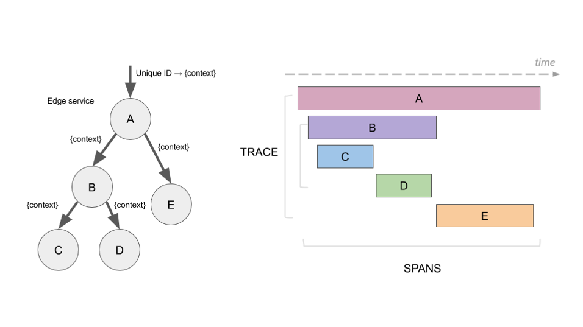
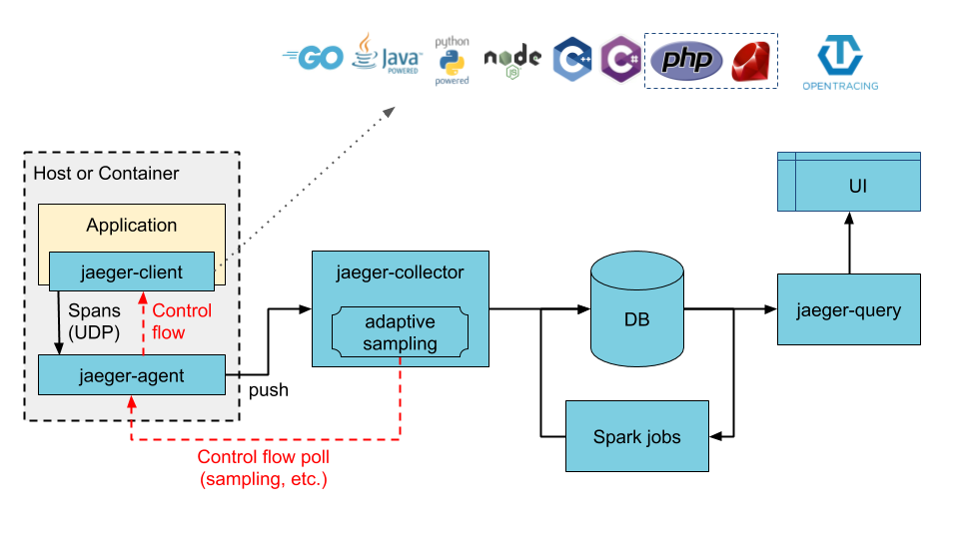
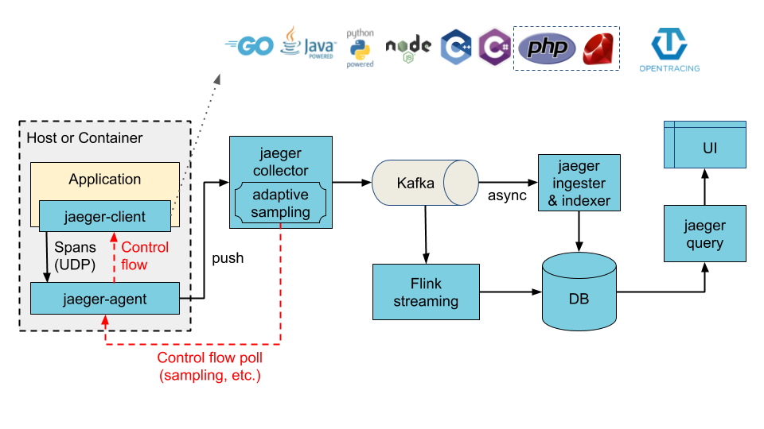
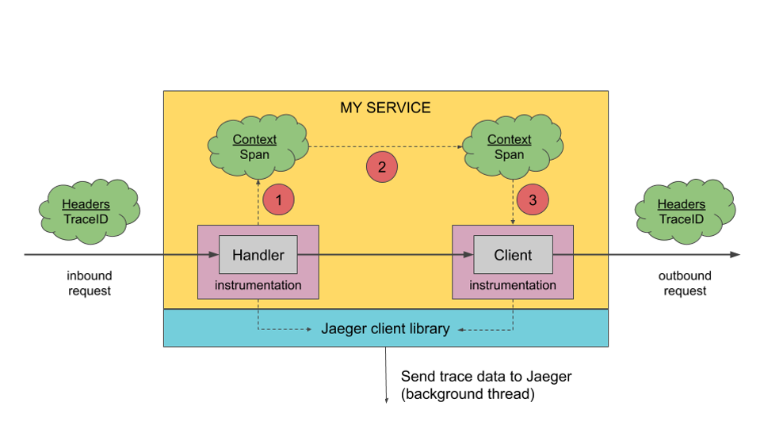

# Cluster Tracing with OpenTracing / Jaeger

## Motivation

In a massively distributed system it‘s essential to know at any time, which path a specific request took through a network of services.

## OpenTracing

The OpenTracing project provides the vendor-neutral standard for distributed tracing.

@see [OpenTracing Homepage](https://opentracing.io/)

## Jaeger

Jaeger is a popular implementation of the OpenTracing standard.

@see [Jaeger Homepage](https://www.jaegertracing.io/)

### Terminology

#### Span 

A `span` represents a logical unit of work in Jaeger that has an operation name, the start time of the operation, and the duration. Spans may be nested and ordered to model causal relationships.

#### Trace

A `trace` is a data/execution path through the system, and can be thought of as a directed acyclic graph of spans

### Architecture

Jaeger supports two databases to store tracing data:

* `Cassandra`: (default)
* `Elasticsearch`

Jaeger supports two architecture options:

* `direct to storage`: the tracing data is directly stored in Cassandra or Elasticsearch.
* `intermediate buffer`: the tracing data through an intermediate buffer like Kafka before it is stored in Cassandra or Elasticsearch.

#### Direct to Storage

A `jaeger client` as a module of your application collects tracing data produced by your application and sends
it to an `jaeger-agent`.

The `jaeger agent` receives all tracing data from various `jaeger clients` and forwards it to the `jaeger collector`.

The `jaeger collector` aggregates all tracing data received from the `jaeger agents`, aggregates it and stores it 
to the `jaeger DB`.

The `jaeger query` components allows the `jaeger UI` to access and visualize the tracing data stored in the `jaeger DB`.
In most installations, `jaeger query` provides the `jaeger UI` as well.

#### Intermediate Buffer

Basically this architecture options works as the one mentioned before except one difference:

The `jaeger collector` does not directly store the tracing data into the `jaeger DB` but forwards it to
an intermediate buffer like Kafka instead. The intermediate buffer sends the tracing data to the `jaeger ingester`
which stores it to the `jaeger DB`. This indirection through an intermediate buffer allows complex analysis and
pre-processing of tracing data before it is stored.
  
### Tracing Context Propagation

Tracing contexts are forwarded from upstream service to downstream service through a dedicated HTTP header named `uber-trace-id`.
This HTTP header contains the unique identifier of the currently active span and trace.
