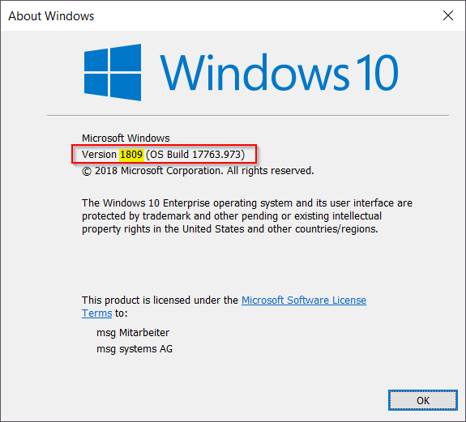

# Installing Hyper-V on Windows 10

## Prerequisites

### Make sure you are running at least Window 10 1809

In order to make Hyper V work on Windows 10 you will have to run at least Windows 10 1809.
Open a simple Windows console and enter the command `winver`. You should see the following dialog `About Windows`:



If the Windows version is `1809` or above, you are safe to continue. If not continue with Oracle Virtual Box.
 
### If you have Virtual Box installed, make sure no virtual machines are running
Although it is possible to install Hyper-V and VirtualBox on the same Windows machine, it is NOT possible to run Hyper-V VMs and VirtualBox VMs at the same time. Before you continue, you have to make sure, that no VirtualBox VMs are running when you install Hyper-V.

## Installing Hyper-V using Powershell

1. Open a PowerShell console as Administrator.
 
2. Run the following command: 
```
Enable-WindowsOptionalFeature -Online -FeatureName Microsoft-Hyper-V -All  
```

3. When the installation has completed, reboot.

Other ways to install Hyper-V are documented at [Install Hyper-V on Windows 10](https://docs.microsoft.com/de-de/virtualization/hyper-v-on-windows/quick-start/enable-hyper-v)
